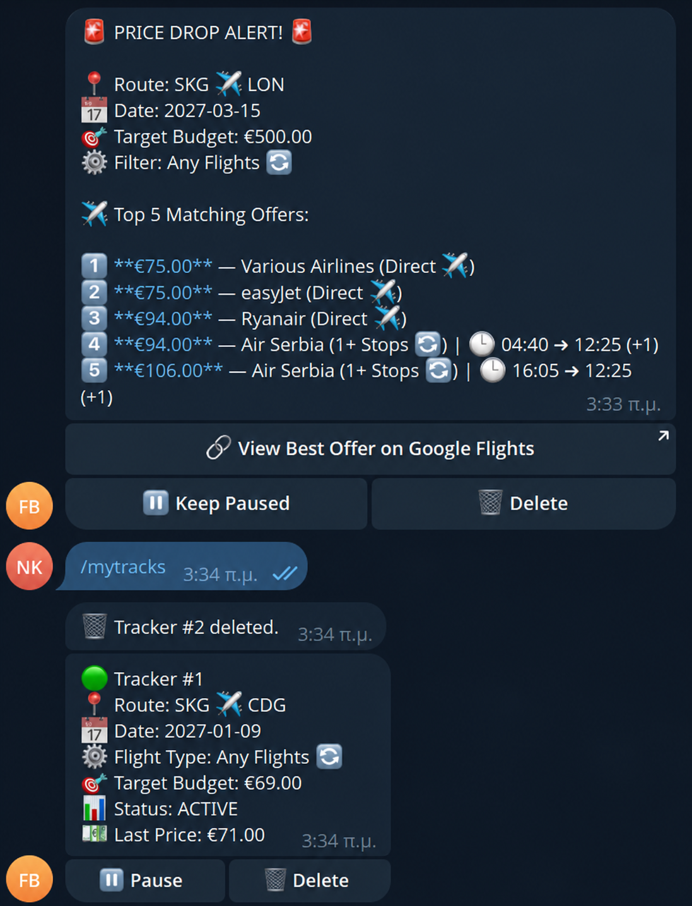

# FareBot

FareBot is an asynchronous Telegram bot that tracks Google Flights prices and notifies you when fares drop below your budget.

Searching flight prices manually across multiple dates requires checking Google Flights repeatedly and recording price changes by hand. FareBot replaces this workflow by automating recurring price searches in the background, storing historical offers in a local SQLite database and sending instant Telegram alerts when a matching fare is found. It is built for developers and self-hosters who want automated flight price monitoring without third-party subscriptions.



## Features

- Single-date and date-range flight search using Google Flights data parsed via fast-flights
- Automated background fare monitoring with configurable polling intervals
- Price drop notification alerts delivered directly via Telegram messages
- Whitelisted user authentication based on Telegram user IDs
- Embedded HTTP health check server for cloud deployments on Render or Railway
- SQLite persistent storage for active trackers and price history

## Requirements

- Python 3.10 or higher
- A Telegram bot token created via BotFather
- Your numeric Telegram User ID

## Installation

Clone the repository and install dependencies in a virtual environment:

```bash
git clone https://github.com/nikosklms/FareBot.git
cd FareBot
python3 -m venv venv
source venv/bin/activate
pip install -r requirements.txt
```

## Quick Start

Copy `.env.example` to `.env` and set your credentials:

```bash
cp .env.example .env
```

Edit `.env` to supply your bot token and numeric Telegram user ID:

```env
TELEGRAM_BOT_TOKEN=123456789:ABCdefGHIjklMNOpqrsTUVwxyz
ALLOWED_USERS=123456789
FAREST_DB_PATH=farebot.db
PORT=10000
```

Start the bot:

```bash
python main.py
```

Send `/start` to your bot on Telegram to verify access.

## Configuration

FareBot reads configuration from environment variables loaded via `.env` at startup.

| Variable | Description | Default |
| --- | --- | --- |
| TELEGRAM_BOT_TOKEN | Telegram bot token obtained from BotFather | Empty string |
| ALLOWED_USERS | Comma-separated list of numeric Telegram User IDs allowed to use the bot | Empty string |
| FAREST_DB_PATH | File path for SQLite database storage | `farebot.db` inside root directory |
| PORT | Port number for the HTTP health check web server | `10000` |

Internal operational limits configured in `config.py`:

| Parameter | Value | Description |
| --- | --- | --- |
| MIN_POLL_INTERVAL_HOURS | 6 | Minimum allowed background polling interval in hours |
| DEFAULT_POLL_INTERVAL_HOURS | 6 | Default polling frequency for new price trackers |
| MAX_TRACKERS_PER_USER | 20 | Maximum active trackers permitted per user |
| MAX_CONSECUTIVE_FAILURES | 3 | Failed search attempts before a tracker is paused |

## Usage

Interact with FareBot using standard Telegram chat commands and interactive inline keyboards.

### Commands

| Command | Description |
| --- | --- |
| `/start` | Verify authorization and view bot status |
| `/help` | View command syntax and usage instructions |
| `/search` | Start flight search wizard for single dates or date ranges |
| `/track` | Create a recurring background price tracker |
| `/dashboard` | View active trackers, delete trackers or trigger manual price checks |
| `/cancel` | Cancel an ongoing wizard session |

## Testing

Run unit and integration tests located in `tests/` using `pytest -v`.

## Limitations and Known Gaps

- Google Flights scraping depends on fast-flights and raw HTML JSON parsing. If Google updates internal payload structures, flight queries may fail until parser definitions are updated.
- Automated requests sent too frequently may trigger HTTP 429 rate limiting from Google Flights. The minimum poll interval is restricted to 6 hours to reduce block risks.
- Round-trip flight tracking is not currently supported; trackers monitor one-way travel segments.
- Payment processing or ticket booking is not handled directly by the bot. Users must click generated Google Flights links to complete purchases on external airline sites.

## Disclaimer

This project is an independent open-source tool created strictly for personal and educational use. It is not affiliated with, authorized by, endorsed by or sponsored by Google LLC or Google Flights. Users are responsible for complying with applicable terms of service when running personal automated queries.

## License

This project is licensed under the MIT License. See the `LICENSE` file for details.

